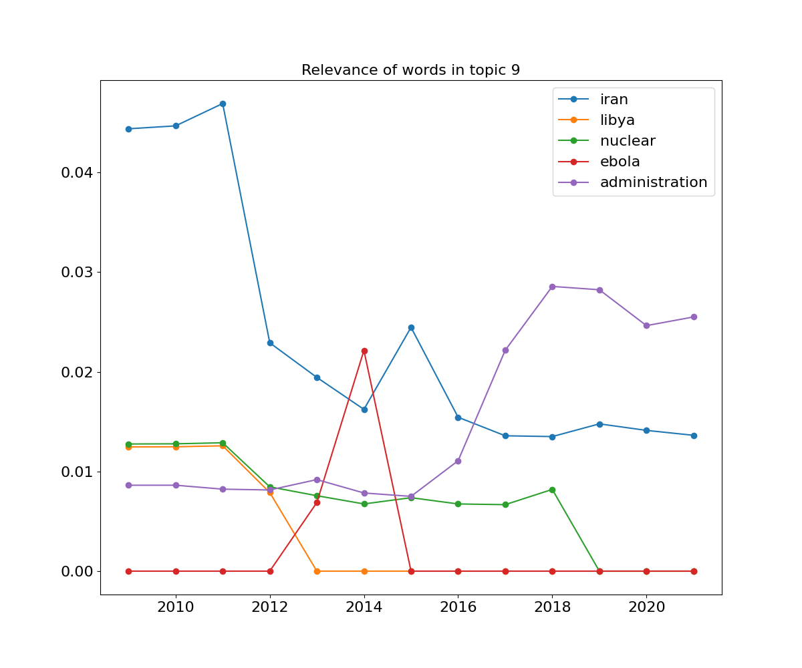

# dynamic-topic-modeling
dynamic topic modeling [Blei and Lafferty (2006)] applied to microblogging and literature\
Here's an example of the evolution of word probability over time in a topic concerning "bad things", taken from Trump's tweets corpus

